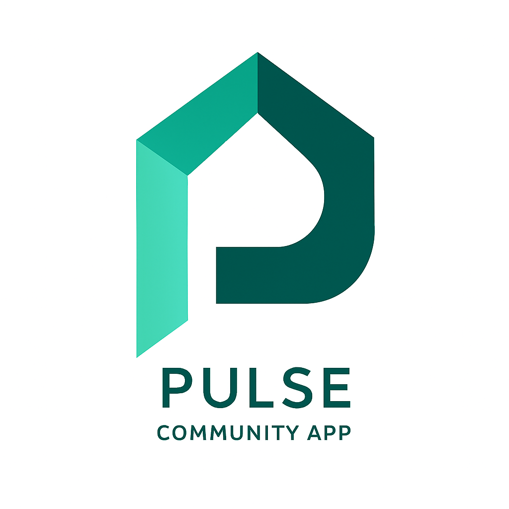

<div align="center">
  

  # PULSE

  **A comprehensive community engagement platform that connects and empowers local communities**

  [](https://flutter.dev)
  [](https://dart.dev)
  [](https://firebase.google.com)
  [](LICENSE)

</div>

---

## 📱 About PULSE

PULSE is a feature-rich community engagement mobile application designed to strengthen local communities through digital connectivity. Built with Flutter and powered by Firebase, it provides a comprehensive platform for community interaction, local commerce, civic engagement, and real-time communication.

## ✨ Key Features

### 🏘️ Community Management
- **Community Notices & Announcements**: Stay informed with real-time community updates
- **Interactive Comments & Engagement**: Like, comment, and engage with community content
- **Media-Rich Content**: Support for images, videos, documents (PDF, DOCX), and file attachments
- **Admin Dashboard**: Comprehensive community management tools for administrators

### 🛒 Local Marketplace
- **Buy & Sell Platform**: Connect with local businesses and community members
- **Seller Dashboard**: Manage listings, track sales, and view analytics
- **Advanced Search & Filtering**: Find items by category, location, and price
- **Seller Ratings & Reviews**: Build trust through community feedback
- **Real-time Chat**: Direct messaging between buyers and sellers

### 🤝 Volunteer Opportunities
- **Community Volunteering**: Discover and participate in local volunteer activities
- **Event Management**: Create, manage, and track volunteer events
- **Participant Tracking**: Monitor volunteer engagement and participation

### 📢 Community Reporting
- **Civic Engagement**: Report community concerns and issues
- **Status Tracking**: Monitor the progress of reported issues
- **Location-Based Reporting**: GPS-enabled reporting with map integration
- **Administrative Review**: Streamlined review process for community administrators

### 💬 Communication
- **Real-time Chat**: Instant messaging between community members
- **Push Notifications**: Stay updated with Firebase Cloud Messaging (FCM)
- **Notification Management**: Customizable notification preferences

### 📊 Analytics & Insights
- **Community Analytics**: Track engagement, growth, and activity metrics
- **Report Generation**: Generate PDF reports for community insights
- **User Profiling**: Barangay-level user analytics and demographics
- **Performance Dashboards**: Real-time community health monitoring

## 🏗️ Technical Architecture

### Frontend
- **Framework**: Flutter 3.5.4+ with Dart 3.0+
- **State Management**: Provider pattern with global state management
- **UI/UX**: Material Design 3 with custom theming
- **Platform Support**: Android, iOS, Web, macOS, Windows, Linux

### Backend & Services
- **Authentication**: Firebase Authentication
- **Database**:
  - Firestore (admin users, community data)
  - Realtime Database (chat, notifications)
- **Storage**: Firebase Storage + Cloudinary for media
- **Push Notifications**: Custom Node.js server with FCM
- **File Handling**: Support for images, videos, PDFs, and documents

### Key Dependencies
- **Firebase Suite**: Core, Auth, Firestore, Realtime Database, Storage, Messaging
- **Media Processing**: Image picker, cropper, compression, video handling
- **Maps & Location**: Flutter Map, Geolocator, Geocoding
- **UI Components**: Charts (fl_chart), PDF generation, QR codes
- **Networking**: HTTP, Dio for file downloads
- **Local Storage**: Shared Preferences, Path Provider

## 🚀 Getting Started

### Prerequisites

- **Flutter SDK**: 3.5.4 or higher
- **Dart SDK**: 3.0 or higher
- **Development Environment**:
  - Android Studio / VS Code
  - Xcode (for iOS development)
- **Firebase Project**: With Authentication, Firestore, and Storage enabled

### Installation

1. **Clone the repository**
   ```bash
   git clone https://github.com/yourusername/pulse_app.git
   cd pulse_app
   ```

2. **Install dependencies**
   ```bash
   flutter pub get
   ```

3. **Firebase Configuration**
   - Create a new Firebase project
   - Enable Authentication, Firestore, Realtime Database, and Storage
   - Download and place `google-services.json` (Android) and `GoogleService-Info.plist` (iOS)
   - Update `firebase_options.dart` with your project configuration

4. **Environment Setup**
   - Configure Cloudinary for media storage (optional)
   - Set up the notification server (see `Pulse-Notiff-Backend-Reference/`)

5. **Run the application**
   ```bash
   flutter run
   ```

## 📁 Project Structure

```
lib/
├── constants/          # App constants and configurations
├── models/            # Data models and entities
├── pages/             # UI screens and pages
│   ├── admin/         # Admin-specific pages
│   ├── super_admin/   # Super admin dashboard
│   └── notifications/ # Notification management
├── services/          # Business logic and API services
├── widgets/           # Reusable UI components
├── utils/             # Utility functions and helpers
└── main.dart          # Application entry point
```

## 🔧 Configuration

### Firebase Setup
1. Create a Firebase project at [Firebase Console](https://console.firebase.google.com)
2. Enable the following services:
   - Authentication (Email/Password)
   - Cloud Firestore
   - Realtime Database
   - Cloud Storage
   - Cloud Messaging

### Notification Server
The app includes a custom Node.js notification server for enhanced push notification capabilities:

```bash
cd Pulse-Notiff-Backend-Reference
npm install
npm run dev
```

Refer to `Pulse-Notiff-Backend-Reference/README.md` for detailed setup instructions.

## 🎯 Usage

### For Community Members
1. **Register/Login**: Create an account or sign in
2. **Join Community**: Enter your community code or scan QR
3. **Explore**: Browse notices, marketplace, and volunteer opportunities
4. **Engage**: Comment, like, and participate in community activities

### For Administrators
1. **Admin Access**: Login with administrator credentials
2. **Manage Content**: Create notices, moderate discussions
3. **Oversee Marketplace**: Review listings and manage sellers
4. **Monitor Reports**: Review and respond to community reports

### For Super Administrators
1. **System Overview**: Access comprehensive analytics dashboard
2. **Community Management**: Oversee multiple communities
3. **User Administration**: Manage admin accounts and permissions
4. **Generate Reports**: Create detailed community insights

## 🤝 Contributing

We welcome contributions to PULSE! Please follow these steps:

1. Fork the repository
2. Create a feature branch (`git checkout -b feature/AmazingFeature`)
3. Commit your changes (`git commit -m 'Add some AmazingFeature'`)
4. Push to the branch (`git push origin feature/AmazingFeature`)
5. Open a Pull Request

### Development Guidelines
- Follow Flutter/Dart best practices
- Maintain consistent code formatting
- Add tests for new features
- Update documentation as needed

## 📄 License

This project is licensed under the MIT License - see the [LICENSE](LICENSE) file for details.


<div align="center">
  <p>Built with ❤️ for stronger communities</p>
  <p>© 2025 PULSE Community Platform. All rights reserved.</p>
</div>
