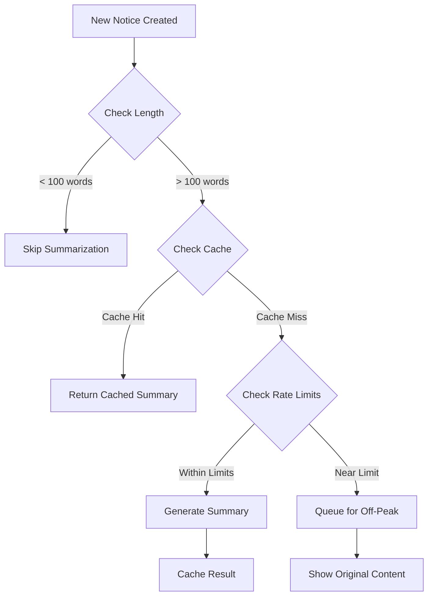
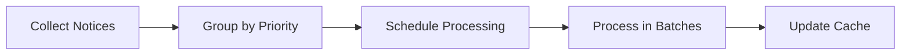
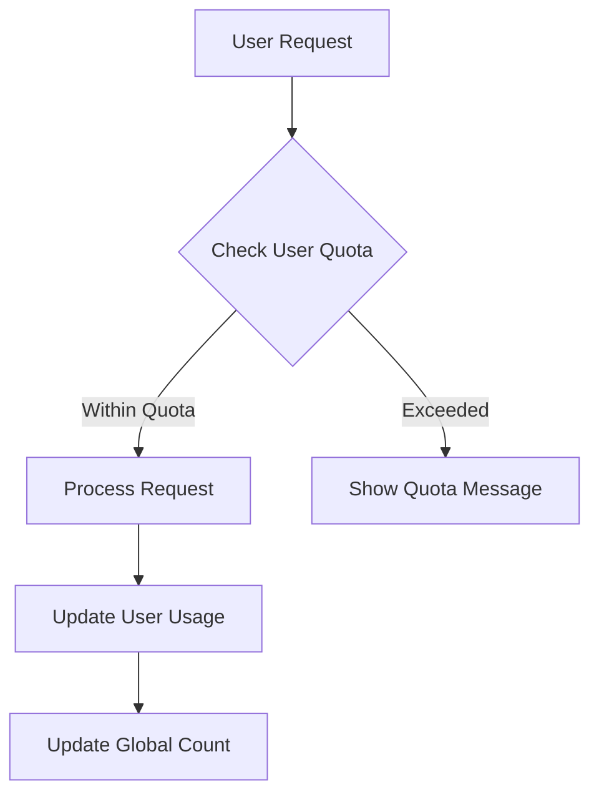

# Community Notice Summarization - Optimized for Gemini Flash 2.0 Free Tier

## AI Model Selection
- **Model**: Google Gemini Flash 2.0
- **Tier**: Free tier
- **Capabilities**:
  - Fast text generation
  - Efficient summarization
  - Low latency responses
  - Optimized for shorter content processing

## API Limits Analysis
- Requests per minute (RPM): 15
- Requests per day (RPD): 1500
- Tokens per minute (TPM): 1M
- Context window: 32K tokens

## Optimization Strategy



### 1. Smart Request Management

#### Daily Budget Distribution
```
Total Daily Requests: 1500
Reserved for Emergency: 100
Available for Regular Use: 1400

Distribution:
- Peak Hours (9 AM - 6 PM): 1000 requests
- Off-Peak Hours: 400 requests
```

#### Request Prioritization System
1. **High Priority** (40% of budget)
   - New community announcements
   - Emergency notices
   - High-engagement content (>100 views)

2. **Medium Priority** (30% of budget)
   - Regular updates
   - Medium-length content

3. **Low Priority** (30% of budget)
   - Old content updates
   - Short content (<200 words)

### 2. Content Optimization

#### Pre-Processing Rules
1. **Length-Based Processing**
   - Skip summarization for content < 100 words
   - Prioritize content between 500-1000 words
   - Break down content > 1000 words into sections

2. **Content Deduplication**
   - Hash content to detect duplicates
   - Reuse summaries for similar content
   - Update cache with latest version

#### Batch Processing Strategy


### 3. Caching Implementation

```dart
class SummaryCache {
  final Duration CACHE_DURATION = Duration(days: 7);

  Future<String?> getSummary(String contentHash) {
    // Check cache first
  }

  Future<void> storeSummary(String contentHash, String summary) {
    // Store with timestamp
  }

  bool shouldRefresh(String contentHash) {
    // Check age and validity
  }
}
```

### 4. Rate Limit Protection

#### Minute-by-Minute Management
```dart
class RateLimiter {
  static const int MAX_RPM = 15;
  static const int SAFETY_THRESHOLD = 12; // 80% of limit

  Queue<DateTime> requestTimes = Queue();

  bool canProcess() {
    _cleanOldRequests();
    return requestTimes.length < SAFETY_THRESHOLD;
  }
}
```

#### Daily Limit Management
```dart
class DailyQuotaManager {
  static const int MAX_RPD = 1500;
  static const int EMERGENCY_RESERVE = 100;

  int dailyCount = 0;
  DateTime resetTime;

  bool hasQuota(Priority priority) {
    return _checkQuotaForPriority(priority);
  }
}
```

### 5. Fallback Mechanisms

1. **When Rate Limited**
   - Show original content
   - Display "Summary coming soon" message
   - Queue for off-peak processing

2. **Cache Strategy**
   - Local storage backup
   - Summary metadata storage
   - Periodic cache cleanup

3. **Error Handling**
   ```dart
   class SummaryProcessor {
     Future<String> getSummary(String content) async {
       try {
         if (await cache.hasValid(content.hash)) {
           return await cache.get(content.hash);
         }

         if (!rateLimiter.canProcess()) {
           return _handleRateLimit(content);
         }

         return await _generateAndCache(content);
       } catch (e) {
         return _handleError(content);
       }
     }
   }
   ```

### 6. Usage Monitoring

#### Metrics to Track
- Current RPM usage
- Daily request count
- Cache hit ratio
- Average summary generation time
- Queue length
- Error rates

#### Alert Thresholds
- RPM > 12 (80% of limit)
- RPD > 1200 (80% of daily limit)
- Cache hit ratio < 60%
- Queue length > 50

### 7. Implementation Phases

1. **Phase 1: Core Infrastructure**
   - Set up caching system
   - Implement rate limiters
   - Create content pre-processor

2. **Phase 2: Smart Processing**
   - Add priority system
   - Implement batch processing
   - Set up monitoring

3. **Phase 3: Optimization**
   - Fine-tune thresholds
   - Optimize cache strategy
   - Implement analytics

### 8. Best Practices

1. **Content Processing**
   - Always check cache first
   - Process in batches when possible
   - Implement content validation

2. **API Usage**
   - Use compression for requests
   - Implement retry with exponential backoff
   - Monitor token usage

3. **Cache Management**
   - Regular cache cleanup
   - Version control for summaries
   - Backup strategy

### 9. Success Metrics

1. **Performance Metrics**
   - Average response time < 2s
   - Cache hit ratio > 80%
   - Zero rate limit violations
   - Summary generation success rate > 95%

2. **User Experience Metrics**
   - Summary availability rate > 90%
   - User engagement increase
   - Reduced bounce rate

3. **System Health Metrics**
   - API quota utilization < 85%
   - Error rate < 1%
   - Queue processing time < 1 hour

### 10. User Quota Management



#### User Quotas By Type
```dart
enum UserType { regular, premium, admin }

class QuotaLimits {
  static const Map<UserType, UserQuota> limits = {
    UserType.regular: UserQuota(
      dailyRequests: 10,
      requestsPerHour: 3,
      maxContentLength: 2000
    ),
    UserType.premium: UserQuota(
      dailyRequests: 30,
      requestsPerHour: 8,
      maxContentLength: 5000
    ),
    UserType.admin: UserQuota(
      dailyRequests: 50,
      requestsPerHour: 15,
      maxContentLength: 10000
    )
  };
}
```

#### Usage Tracking Implementation
```dart
class UserUsageTracker {
  final String userId;
  final UserType userType;

  int dailyCount = 0;
  int hourlyCount = 0;
  DateTime lastRequest;

  bool canMakeRequest() {
    final quota = QuotaLimits.limits[userType];
    return dailyCount < quota.dailyRequests &&
           hourlyCount < quota.requestsPerHour;
  }

  Future<void> trackRequest() async {
    await _updateCounts();
    await _checkForAbuse();
  }
}
```

#### Anti-Abuse Measures
```dart
class AbuseDetector {
  static const int SUSPICIOUS_REQUESTS_PER_MINUTE = 5;
  static const Duration COOLDOWN = Duration(minutes: 15);

  Future<bool> checkForAbuse(String userId) async {
    final recentRequests = await _getRecentRequests(userId);
    if (_isPatternSuspicious(recentRequests)) {
      await _applyCooldown(userId);
      return true;
    }
    return false;
  }
}
```

#### Quota Management Strategy

1. **Fair Distribution**
   - Base quotas by user type
   - Automatic daily/hourly resets
   - Gradual quota increases for trusted users

2. **Dynamic Adjustments**
   - Increase limits during low-usage periods
   - Reduce limits during peak times
   - Special event allocations

3. **User Experience**
   - Clear quota displays
   - Warning notifications at 80% usage
   - Upgrade paths for regular users

4. **Monitoring & Analytics**
   - Per-user usage patterns
   - System-wide distribution
   - Abuse detection rates

#### Implementation Priority

1. **Phase 1: Basic Quotas**
   - User type quotas
   - Usage tracking
   - Basic anti-abuse

2. **Phase 2: Advanced Features**
   - Dynamic adjustments
   - Warning system
   - Analytics dashboard

3. **Phase 3: Optimization**
   - Usage pattern analysis
   - Quota fine-tuning
   - Performance improvements